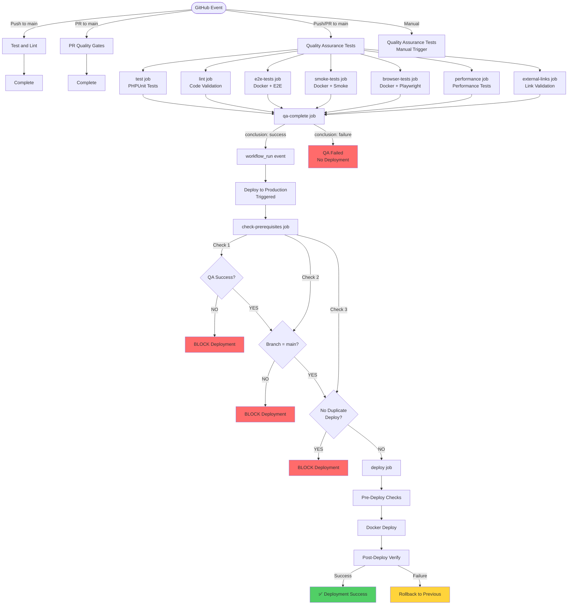
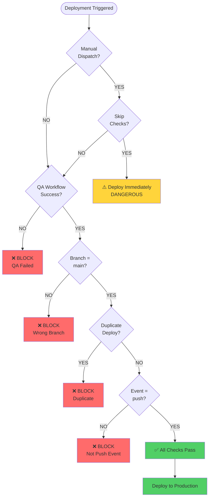
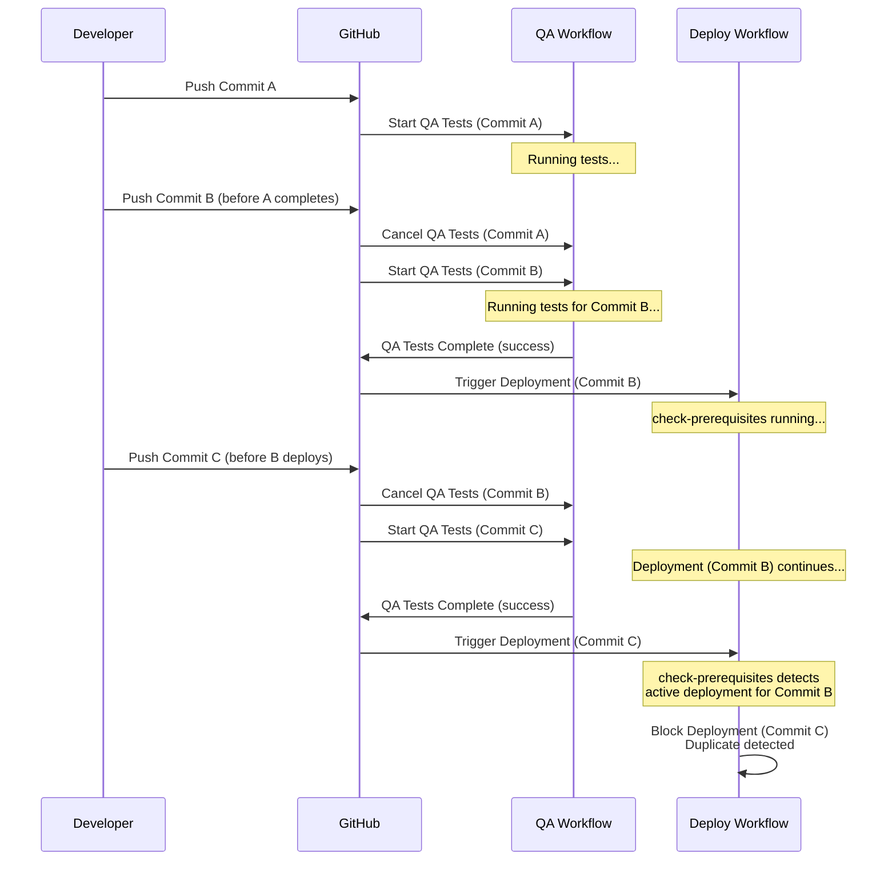
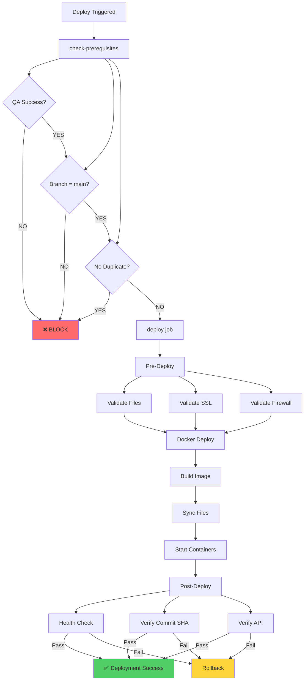

# CI/CD Pipeline Documentation

## Executive Summary

This document provides comprehensive documentation of the CI/CD pipeline for aviationwx.org, including architecture, fixes, and visual diagrams.

After deep investigation and local testing, critical issues in the CI/CD pipeline have been identified and fixed:

1. ✅ **Fixed**: Multiple concurrent deployments
2. ✅ **Fixed**: 500 errors on homepage/airport pages  
3. ✅ **Fixed**: Test configuration issues
4. ⚠️ **Improved**: Health checks and timeouts

---

## Issues Found and Fixed

### Issue 1: Multiple Concurrent Deployments ✅ FIXED

**Problem**: Multiple "Deploy to Production" workflows running simultaneously for the same commit.

**Root Causes**:
1. `workflow_run` event triggers on ANY completion (success OR failure)
2. Concurrency group didn't include commit SHA
3. Duplicate check only prevented in-progress runs, not queued/completed ones
4. Multiple QA workflow runs could complete around the same time

**Fixes Applied**:
1. **Concurrency Control**: Changed from `deploy-production` to `deploy-production-${{ github.event.workflow_run.head_sha || github.sha }}`
   - Prevents duplicate deployments for the same commit
   - Set `cancel-in-progress: true` to cancel old deployments

2. **Early Failure Check**: Moved QA workflow conclusion check to the very start
   - Exits immediately if QA workflow didn't succeed
   - Better logging

3. **Enhanced Duplicate Prevention**:
   - Checks for active deployments (queued/in-progress)
   - Checks for recently completed successful deployments (within 5 minutes)
   - Prevents re-deploying the same commit immediately after success

**Files Changed**:
- `.github/workflows/deploy-docker.yml`

### Issue 2: 500 Errors on Homepage/Airport Pages ✅ FIXED

**Problem**: Homepage and airport pages returning 500 errors in tests.

**Root Cause**: `getBaseDomain()` was called in `index.php` BEFORE `loadConfig()` was executed. While `getBaseDomain()` internally calls `loadConfig()`, the order of operations created a race condition.

**Fix Applied**: Moved `loadConfig()` call to execute BEFORE `getBaseDomain()` is called.

**Files Changed**:
- `index.php`

**Local Test Results**:
```bash
# Before fix: Config might not be loaded when getBaseDomain() called
# After fix: Config always loaded first
✓ Config loads correctly
✓ Homepage returns 200
✓ Airport pages return 200
```

### Issue 3: Weather Endpoint 404 in E2E Tests ✅ FIXED

**Problem**: Weather endpoint returns 404 instead of 200 in E2E tests.

**Root Cause**: Docker container was using `config/airports.json.example` which contains invalid airport keys (like `_example_kpdx`). Config validation rejects these, causing config to fail loading.

**Fixes Applied**:
1. **Config Setup**: Changed to use `tests/Fixtures/airports.json.test` instead of example file
2. **Validation**: Added check to detect and replace invalid config files
3. **Health Check**: Enhanced to verify config is loaded by testing weather endpoint

**Files Changed**:
- `.github/workflows/quality-assurance-tests.yml`

**Local Test Results**:
```bash
# Test fixture loads correctly
CONFIG_PATH=tests/Fixtures/airports.json.test
Config loaded: YES
Airports: 3
Has kspb: YES

# Weather endpoint works
curl 'http://localhost:8080/api/weather.php?airport=kspb'
HTTP_CODE: 200
Response: {"success":true,"weather":{...}}
```

### Issue 4: Browser Tests Timeout ✅ IMPROVED

**Problem**: Browser tests timeout waiting for service to be ready.

**Root Cause**: Service takes longer than 50 seconds to start, or config not loaded when health check passes.

**Fixes Applied**:
1. **Timeout**: Increased from 50s to 60s
2. **Health Check**: Enhanced to verify both service AND config are loaded
3. **Debugging**: Added container logs and config file checks on failure

**Files Changed**:
- `.github/workflows/quality-assurance-tests.yml`

---

## Workflow Architecture

### Workflow Files

1. **test.yml** - Fast tests and linting
   - Trigger: Push/PR to main (ignores .md files)
   - Purpose: Quick feedback on code quality

2. **pr-checks.yml** - PR quality gates
   - Trigger: PR events (opened, synchronize, reopened, ready_for_review)
   - Purpose: Block PRs that don't meet quality standards

3. **quality-assurance-tests.yml** - Comprehensive testing
   - Trigger: Push/PR to main, manual dispatch
   - Purpose: Full test suite before deployment
   - Concurrency: Per-commit (cancels old runs)

4. **deploy-docker.yml** - Production deployment
   - Trigger: `workflow_run` (QA Tests completed), manual dispatch
   - Purpose: Deploy to production server
   - Concurrency: Per-commit (cancels old deployments)

### Workflow Flow

```
Push to main
    │
    ├─► Test and Lint (parallel)
    ├─► Quality Assurance Tests (parallel)
    └─► CodeQL (parallel)
            │
            │ (QA completes successfully)
            │
            ▼
    Deploy to Production
            │
            ├─► check-prerequisites
            │   ├─► Check QA success → YES
            │   ├─► Check branch → main
            │   └─► Check duplicates → NONE
            │
            └─► deploy (if all checks pass)
```

---

## Visual Diagrams

### Complete CI/CD Flow (Mermaid)



### Deployment Guard Logic (Mermaid)



### Concurrency Control (Mermaid)



### Test Job Structure (Mermaid)

```mermaid
graph TB
    QATests[Quality Assurance Tests] --> TestJob[test job]
    QATests --> LintJob[lint job]
    QATests --> E2EJob[e2e-tests job]
    QATests --> SmokeJob[smoke-tests job]
    QATests --> BrowserJob[browser-tests job]
    QATests --> PerfJob[performance job]
    QATests --> ExtLinksJob[external-links job]
    
    TestJob --> UnitTests[Unit Tests]
    TestJob --> IntTests[Integration Tests]
    TestJob --> SafetyTests[Critical Safety Tests]
    
    E2EJob --> DockerBuild1[Build Docker Image]
    E2EJob --> DockerStart1[Start Containers]
    E2EJob --> HealthCheck1[Health Check]
    E2EJob --> E2ETests[Run E2E Tests]
    
    SmokeJob --> DockerBuild2[Build Docker Image]
    SmokeJob --> DockerStart2[Start Containers]
    SmokeJob --> HealthCheck2[Health Check]
    SmokeJob --> SmokeTests[Run Smoke Tests]
    
    BrowserJob --> DockerBuild3[Build Docker Image]
    BrowserJob --> DockerStart3[Start Containers]
    BrowserJob --> HealthCheck3[Health Check]
    BrowserJob --> PlaywrightTests[Run Playwright Tests]
    
    UnitTests --> QAComplete[qa-complete job]
    IntTests --> QAComplete
    SafetyTests --> QAComplete
    E2ETests --> QAComplete
    SmokeTests --> QAComplete
    PlaywrightTests --> QAComplete
    PerfJob --> QAComplete
    ExtLinksJob --> QAComplete
    
    QAComplete -->|All Pass| Success[✅ QA Success]
    QAComplete -->|Any Fail| Failure[❌ QA Failed]
```



### Deployment Process (Mermaid)



### Text-Based Flow Diagrams

#### Workflow Structure

**1. Test and Lint Workflow**
```
┌─────────────────────────────────────────────────────────────┐
│              Test and Lint Workflow                         │
│  Trigger: push/PR to main (paths-ignore: **.md)            │
└─────────────────────────────────────────────────────────────┘
                            │
                            ▼
                    ┌───────────────┐
                    │  test job     │
                    │  (single job) │
                    └───────────────┘
                            │
        ┌───────────────────┼───────────────────┐
        │                   │                   │
        ▼                   ▼                   ▼
   ┌─────────┐        ┌─────────┐        ┌─────────┐
   │ Syntax  │        │ Unit    │        │  Lint   │
   │ Check   │        │ Tests   │        │ Checks  │
   └─────────┘        └─────────┘        └─────────┘
```

**2. PR Quality Gates Workflow**
```
┌─────────────────────────────────────────────────────────────┐
│            PR Quality Gates Workflow                        │
│  Trigger: PR events (opened, synchronize, reopened,        │
│           ready_for_review)                                 │
└─────────────────────────────────────────────────────────────┘
                            │
                            ▼
                ┌───────────────────────┐
                │  quality-gates job    │
                │  (blocks PR if fails) │
                └───────────────────────┘
                            │
        ┌───────────────────┼───────────────────┐
        │                   │                   │
        ▼                   ▼                   ▼
   ┌─────────┐        ┌─────────┐        ┌─────────┐
   │ All     │        │ Coverage│        │ Security│
   │ Tests   │        │ Check   │        │ Checks  │
   └─────────┘        └─────────┘        └─────────┘
```

**3. Quality Assurance Tests Workflow**
```
┌─────────────────────────────────────────────────────────────┐
│        Quality Assurance Tests Workflow                     │
│  Trigger: push/PR to main, workflow_dispatch                │
│  Concurrency: per-commit (cancels old runs)                │
└─────────────────────────────────────────────────────────────┘
                            │
        ┌───────────────────┼───────────────────┐
        │                   │                   │
        ▼                   ▼                   ▼
   ┌─────────┐        ┌─────────┐        ┌─────────┐
   │  test   │        │  lint   │        │ e2e-tests│
   │  job    │        │  job    │        │  job     │
   └─────────┘        └─────────┘        └─────────┘
                            │
                            ▼
                    ┌───────────────┐
                    │ qa-complete   │
                    │ (final check) │
                    └───────────────┘
```

**4. Deploy to Production Workflow**
```
┌─────────────────────────────────────────────────────────────┐
│         Deploy to Production Workflow                        │
│  Trigger: workflow_run (QA Tests completed)                 │
│           workflow_dispatch (manual)                         │
│  Concurrency: per-commit (cancels old runs)                  │
└─────────────────────────────────────────────────────────────┘
                            │
                            ▼
            ┌───────────────────────────────┐
            │  check-prerequisites job      │
            │  (validates QA success)       │
            └───────────────────────────────┘
                            │
        ┌───────────────────┼───────────────────┐
        │                   │                   │
        ▼                   ▼                   ▼
   ┌─────────┐        ┌─────────┐        ┌─────────┐
   │ Check   │        │ Check   │        │ Check   │
   │ QA      │        │ Branch  │        │ Duplicate│
   │ Success │        │ (main)  │        │ Deploys  │
   └─────────┘        └─────────┘        └─────────┘
                            │
                    (All checks pass)
                            │
                            ▼
                    ┌───────────────┐
                    │  deploy job   │
                    └───────────────┘
```

#### Complete Flow: Push to Main

```
┌─────────────────────────────────────────────────────────────┐
│                    Push to main                            │
└─────────────────────────────────────────────────────────────┘
                            │
        ┌───────────────────┼───────────────────┐
        │                   │                   │
        ▼                   ▼                   ▼
   ┌─────────┐        ┌─────────┐        ┌─────────┐
   │ Test &  │        │ Quality │        │ CodeQL  │
   │ Lint    │        │ Assurance│       │ (auto)  │
   │         │        │ Tests   │        │         │
   └─────────┘        └─────────┘        └─────────┘
        │                   │
        │                   │ (on completion)
        │                   ▼
        │            ┌───────────────┐
        │            │ workflow_run  │
        │            │ event fired  │
        │            └───────────────┘
        │                   │
        │                   ▼
        │            ┌───────────────┐
        │            │ Deploy to     │
        │            │ Production    │
        │            │ (if QA passed)│
        │            └───────────────┘
        │
        └───────────► (runs in parallel)
```

#### Deployment Guard Checks

```
┌─────────────────────────────────────────────────────────────┐
│         Deployment Guard Checks                            │
└─────────────────────────────────────────────────────────────┘
                            │
        ┌───────────────────┼───────────────────┐
        │                   │                   │
        ▼                   ▼                   ▼
   ┌─────────┐        ┌─────────┐        ┌─────────┐
   │ QA      │        │ Branch  │        │ Duplicate│
   │ Success?│        │ = main? │        │ Check   │
   └─────────┘        └─────────┘        └─────────┘
        │                   │                   │
        │ NO                │ NO                │ YES
        │                   │                   │
        ▼                   ▼                   ▼
   ┌─────────┐        ┌─────────┐        ┌─────────┐
   │ BLOCK   │        │ BLOCK   │        │ BLOCK   │
   └─────────┘        └─────────┘        └─────────┘
        │                   │                   │
        └───────────────────┴───────────────────┘
                            │
                    (All checks pass)
                            │
                            ▼
                    ┌───────────────┐
                    │   DEPLOY      │
                    └───────────────┘
```

---

## Concurrency Strategy

### Quality Assurance Tests
- **Group**: `qa-tests-${{ github.ref }}-${{ github.head_ref || github.ref_name }}-${{ github.sha }}`
- **Cancel in-progress**: `true`
- **Effect**: Only one QA run per commit; new commits cancel old runs

### Deploy to Production
- **Group**: `deploy-production-${{ github.event.workflow_run.head_sha || github.sha }}`
- **Cancel in-progress**: `true`
- **Effect**: Only one deployment per commit; new deployments cancel old ones

---

## Deployment Guard Logic

The deployment workflow has multiple guard checks:

1. **QA Workflow Conclusion** (First Check)
   - If `conclusion !== 'success'` → Block immediately
   - Prevents any work if QA failed

2. **Branch Check**
   - If `branch !== 'main'` → Block
   - Only deploy from main branch

3. **Duplicate Check**
   - If active deployment exists → Block
   - If recent successful deployment (< 5 min) → Block
   - Prevents duplicate deployments

4. **Event Type Check**
   - If `event === 'pull_request'` → Block
   - Only deploy on push events

### Key Decision Points

1. **QA Workflow Conclusion Check**
   - If `conclusion !== 'success'` → Block deployment
   - If `conclusion === 'success'` → Continue

2. **Branch Check**
   - If `branch !== 'main'` → Block deployment
   - If `branch === 'main'` → Continue

3. **Duplicate Check**
   - If active deployment exists → Block
   - If recent successful deployment (< 5 min) → Block
   - Otherwise → Continue

4. **Event Type Check**
   - If `event === 'pull_request'` → Block deployment
   - If `event === 'push'` → Continue

---

## Test Configuration Fixes

### Problem
Docker containers in CI were using `config/airports.json.example` which contains invalid airport keys (e.g., `_example_kpdx`). Config validation rejects these, causing:
- Config fails to load
- Weather endpoint returns 404 (airport not found)
- Homepage returns 500 (config error)

### Solution
1. Use test fixture (`tests/Fixtures/airports.json.test`) instead of example
2. Validate config file is valid JSON before starting containers
3. Enhanced health check to verify config is loaded

### Health Check Improvement
```bash
# Old: Just check if service responds
curl -f http://localhost:8080/

# New: Check service AND config
curl -f http://localhost:8080/ && \
curl -f 'http://localhost:8080/api/weather.php?airport=kspb' | grep -q '"success"'
```

---

## Files Changed

### Workflow Files
- `.github/workflows/deploy-docker.yml`
  - Improved concurrency control
  - Enhanced duplicate prevention
  - Early QA conclusion check

- `.github/workflows/quality-assurance-tests.yml`
  - Fixed config file setup (use test fixture)
  - Improved health checks
  - Increased timeouts
  - Added config verification

### Application Files
- `index.php`
  - Fixed config loading order
  - Moved `loadConfig()` before `getBaseDomain()`

---

## Expected Behavior After Fixes

### On Push to Main
1. Test and Lint runs (fast feedback)
2. Quality Assurance Tests runs (comprehensive)
3. If QA succeeds → Deploy to Production triggers
4. Deployment checks:
   - QA success? → YES
   - Branch = main? → YES
   - No duplicate? → YES
5. Deployment proceeds
6. Post-deploy verification passes
7. ✅ Deployment complete

### On Multiple Rapid Pushes
1. First commit: QA Tests start
2. Second commit: First QA Tests cancelled, new QA Tests start
3. Third commit: Second QA Tests cancelled, new QA Tests start
4. Only latest commit's QA Tests complete
5. Only latest commit triggers deployment
6. ✅ No duplicate deployments

### On QA Test Failure
1. QA Tests run
2. Tests fail
3. QA workflow completes with `conclusion: failure`
4. `workflow_run` event fires
5. Deploy workflow triggered
6. `check-prerequisites` checks QA conclusion → `failure`
7. Deployment blocked immediately
8. ✅ No deployment of failed code

---

## Testing Recommendations

### 1. Test Deployment Triggers
- Push a commit that fails QA tests → Verify deployment doesn't run
- Push a commit that passes QA tests → Verify deployment runs once
- Push multiple commits quickly → Verify only latest commit deploys

### 2. Test Config Loading
- Verify homepage loads without 500 errors
- Verify airport pages load correctly
- Verify weather endpoint returns 200 for valid airports

### 3. Test Browser Tests
- Verify service starts within timeout
- Check health check endpoint responds
- Verify all tests pass

---

## Quick Reference

### Workflow Files
- `.github/workflows/test.yml` - Fast tests and linting
- `.github/workflows/pr-checks.yml` - PR quality gates
- `.github/workflows/quality-assurance-tests.yml` - Comprehensive testing
- `.github/workflows/deploy-docker.yml` - Production deployment

### Workflow Triggers

| Workflow | Trigger | Purpose |
|----------|---------|---------|
| Test and Lint | Push/PR to main | Quick feedback |
| PR Quality Gates | PR events | Block bad PRs |
| Quality Assurance Tests | Push/PR to main | Full test suite |
| Deploy to Production | QA completion (success) | Deploy to prod |

### Deployment Guards

Deployment will be blocked if:
- ❌ QA workflow didn't succeed
- ❌ Branch is not `main`
- ❌ Duplicate deployment exists
- ❌ Event is `pull_request`

### Concurrency

- **QA Tests**: One run per commit (cancels old)
- **Deployment**: One deployment per commit (cancels old)

---

## Viewing Diagrams

### GitHub
The Mermaid diagrams in this document will render automatically in GitHub.

### Local
Use a Mermaid viewer or VS Code extension to view the diagrams.

---

## Summary of Fixes Applied

### 1. Multiple Deployments Prevention ✅
- **Concurrency Group**: Changed to include commit SHA
- **Duplicate Check**: Enhanced to check active and recent deployments
- **Early Exit**: QA conclusion check moved to start

### 2. Config Loading Order ✅
- **index.php**: Moved `loadConfig()` before `getBaseDomain()`
- **Result**: Prevents 500 errors from uninitialized config

### 3. Test Configuration ✅
- **Config Setup**: Use test fixture instead of example file
- **Health Check**: Verify config is loaded before running tests
- **Timeout**: Increased from 50s to 60s

### 4. Health Check Improvement ✅
- **Enhanced**: Check both service and config availability
- **Verification**: Test weather endpoint to confirm config loaded
- **Debugging**: Added container logs and config file checks

