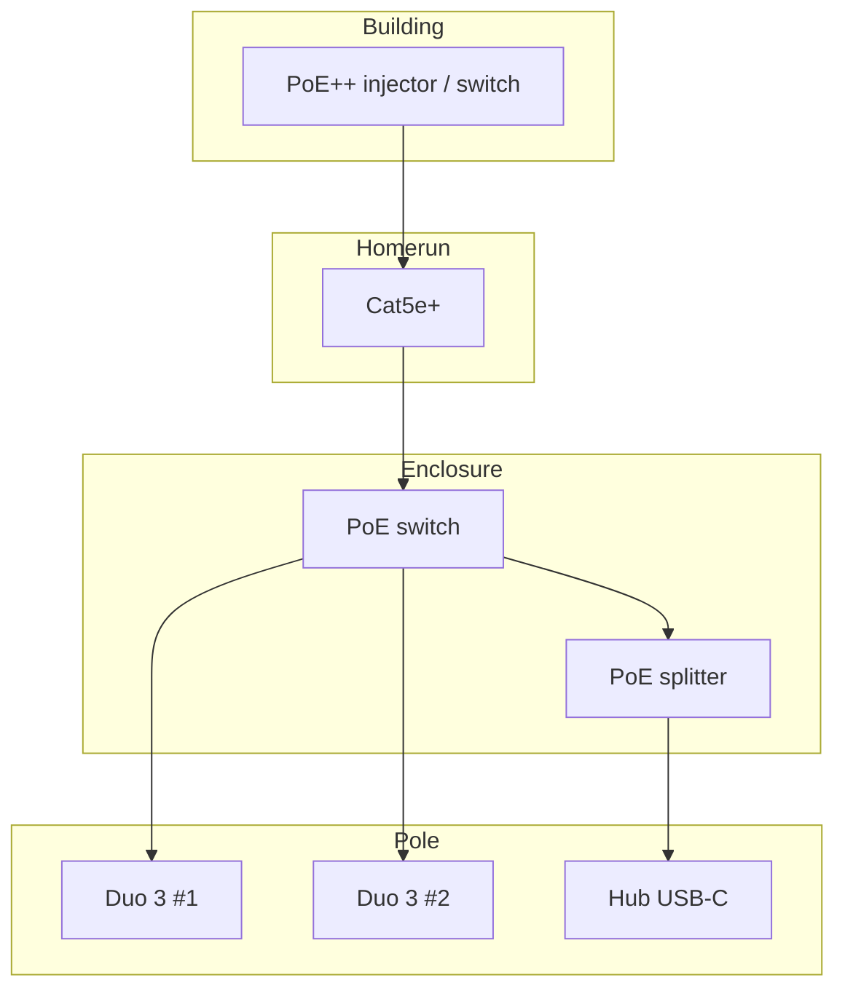
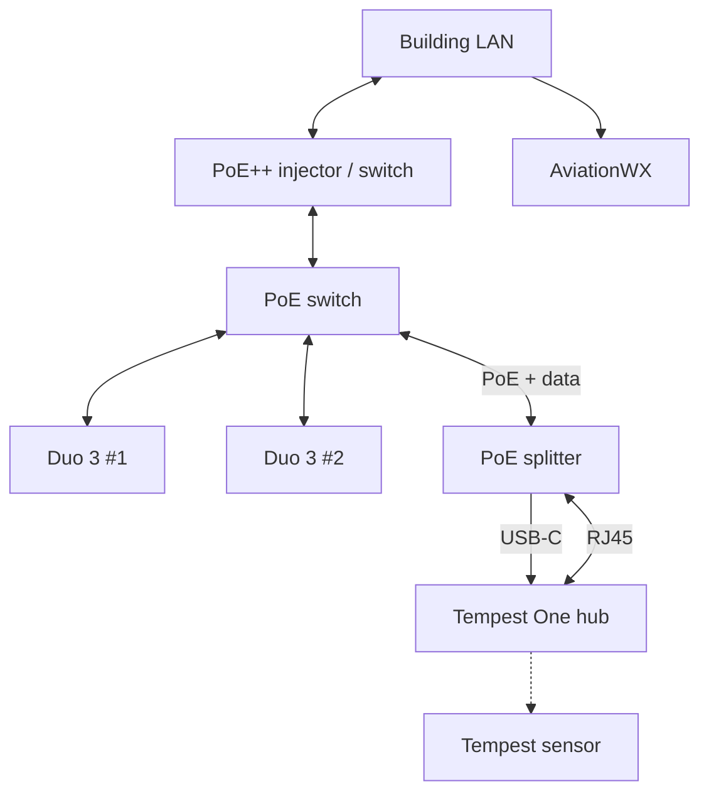
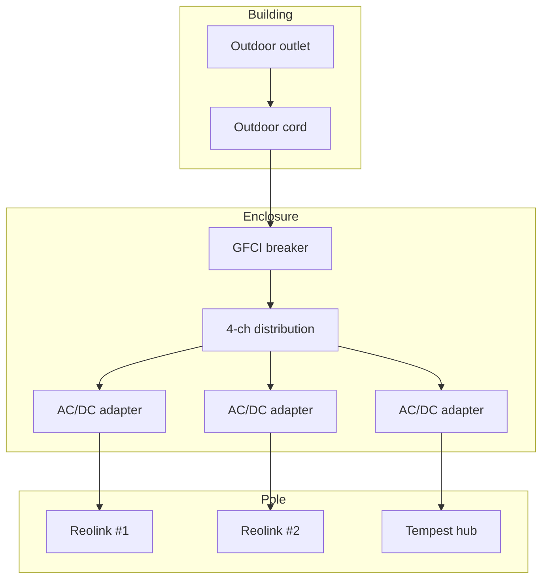
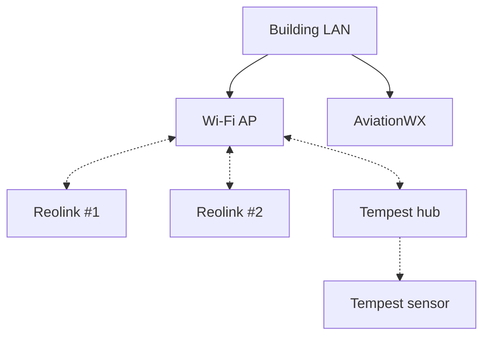

# 16 - Installer Resources

Curated parts lists, drawings, and field photos for common AviationWX installs. For permission, siting, power, and software setup, see the numbered guides (especially [03](03-mounting-options.md), [05](05-power-options.md), [06](06-internet-options.md), [07](07-equipment-recommendations.md), [08](08-camera-configuration.md), [09](09-weather-station-configuration.md), [11](11-installation-planning-and-handoff.md)).

These are reference designs, not mandatory SKUs. Substitute parts when they meet the same siting, power, and data goals. Paths A and B are field-tested; other paths below are placeholders until we publish BOMs and photos.

Questions or to share a working install (photos, BOM tweaks, drawings): [contact@aviationwx.org](mailto:contact@aviationwx.org). Pull requests welcome on [github.com/alexwitherspoon/aviationwx.org](https://github.com/alexwitherspoon/aviationwx.org) under `guides/` and `public/guides/installer-resources/`.

Empty sections below mean not documented yet, not disallowed.

---

## Pick a path

| Path | Use when |
|------|----------|
| A - PoE pole (building-fed) | Building has LAN + PoE++; one outdoor Ethernet homerun powers the pole |
| B - AC pole + building Wi-Fi | Building has 120 V AC and reliable Wi-Fi at the pole; no Ethernet homerun |
| C - Remote pole + 120 V + PTP | Pole is far from the building; 120 V at pole; internet via wireless point-to-point |
| D - Local 120 V, no internet | 120 V at pole; no usable WAN on site |
| E - Off-grid | No building power or LAN; solar, battery, and on-pole internet |

---

## Reference A - PoE pole (building-fed)

One outdoor Cat5e+ homerun carries Ethernet and PoE++ to a weatherproof enclosure. A pole-mounted PoE switch powers two Reolink Duo 3 PoE cameras (180° dual-lens each) and a gigabit PoE splitter for the Tempest One hub (USB-C power, RJ45 data). No AC at the pole and no Wi-Fi bridge for backhaul.

Mount two Duo 3 units on opposite sides of the pole when you need two approach views. One `pole-mount-reolink-duo-3.stl` print per camera (see [3D prints](#3d-prints)).

### Wiring

Power (PoE)

Data (Ethernet)

Hub wiring uses one switch PoE port into the [TYPEC0503G splitter](https://www.amazon.com/dp/B09GM8FB3X) (802.3af/at). USB-C supplies hub power; a short patch goes splitter RJ45 to hub RJ45 (data only; hub jack is not PoE). Do not patch hub RJ45 straight to the switch.

| Box location | Count | Purpose |
|--------------|-------|---------|
| Bottom | 1 | Building homerun |
| Side | 2 | One per camera |
| Inside | 3 short patches | Bulkheads to switch; switch to splitter; splitter to hub |

### Photos

Photos show a consumer Tempest hub for layout only. Use [Tempest One](https://shop.tempest.earth/collections/all/products/tempest-for-commercial-use) with the splitter wiring above.

### Parts list

| Qty | Item | Notes | Link |
|-----|------|-------|------|
| 1 | Skywalker 12" wall mount (pair) | Pole to building | [B008USJ1CW](https://www.amazon.com/dp/B008USJ1CW) |
| 1 | Steel pole | Match clamp size; length per site | Local |
| 1 | QILIPSU pole mounting kit | Box to pole | [B0B4DW4HFM](https://www.amazon.com/dp/B0B4DW4HFM) |
| 1 | Weatherproof enclosure | Room for switch, hub, cable bend | Local |
| 1 | NUBASA 5-port PoE switch | 1× PoE++ in, 4× 802.3at out | [B0G38WMW8Y](https://www.amazon.com/dp/B0G38WMW8Y) |
| 1 | NUBASA 90 W PoE++ injector | At building if uplink port is not PoE++ | [B0FH26T8DB](https://www.amazon.com/dp/B0FH26T8DB) |
| 2 | Reolink Duo 3 PoE | 180° dual-lens; one mount + one cable each | [B0CM39K7CB](https://www.amazon.com/dp/B0CM39K7CB) |
| 2 | 3D-printed Duo 3 pole mount | `pole-mount-reolink-duo-3.stl`; see [3D prints](#3d-prints) | [3D prints](#3d-prints) |
| 2 | Stainless worm band clamp | One per mount; worm clamp sizes with `pole-mount-reolink-duo-3.stl` in [3D prints](#3d-prints) | Local |
| 1 | Tempest sensor + hub | Tempest One per [Guide 07](07-equipment-recommendations.md) | Tempest shop |
| 1 | Gigabit PoE splitter | USB-C + RJ45 passthrough (TYPEC0503G) | [B09GM8FB3X](https://www.amazon.com/dp/B09GM8FB3X) |
| 1 | Ethernet bulkhead (bottom) | Building homerun | [B0BWXBL16Q](https://www.amazon.com/dp/B0BWXBL16Q) |
| 2 | Ethernet bulkhead (side) | One per camera | [B0C89PDH7X](https://www.amazon.com/dp/B0C89PDH7X) |
| 1 | Outdoor Cat5e/Cat6 | Building to bottom bulkhead | Local |
| 3 | Short outdoor Cat5e patches | 2 cameras + splitter to hub | Local |

### Install checklist (Path A)

1. Mount pole, enclosure, and bulkheads; pull homerun to bottom bulkhead.
2. Mount both `pole-mount-reolink-duo-3.stl` clamps; run PoE through side bulkheads; aim lenses.
3. Mount Tempest sensor clear of camera view.
4. Terminate homerun at switch PoE++ IN; patch cameras; splitter on one PoE port; USB-C and RJ45 to hub.
5. Configure per Guides 08/09; commission per Guide 11.

---

## Reference B - AC pole + building Wi-Fi

120 V from the building feeds a pole-mounted NEMA box. A GFCI breaker and four-channel distribution board power the OEM AC/DC adapters for two Reolink Wi-Fi cameras and the Tempest hub. Data uses building Wi-Fi (no Ethernet homerun).

Same pole layout idea as Path A: Tempest on top, two 180° cameras on the strut, enclosure on the pole. Use `pole-mount-reolink-duo-3.stl` when the Wi-Fi camera body fits that print (see [3D prints](#3d-prints)).

### Wiring

Power (120 V)

Data (Wi-Fi)

### Wi-Fi

Test signal with a phone at the enclosure before you close the box. Weak Wi-Fi will fail in the field; improve AP placement, add an outdoor AP, or use Path A.

Cameras and hub can join on 2.4 or 5 GHz. Use whichever band pairs reliably at install and stick with it.

Prefer a dedicated equipment SSID (or VLAN), not guest Wi-Fi. Avoid networks with captive portals or passwords that change often; gear usually needs a site visit to rejoin.

Record SSID, band, and where credentials are stored ([Guide 11](11-installation-planning-and-handoff.md)). Broader context: [Guide 06](06-internet-options.md) Option A.

### Building feed (120 V)

1. Outdoor-rated extension cord (SJTW, grounded). Length per site ([15 ft example](https://www.amazon.com/dp/B0C7GTPX6F)).
2. Male plug into a weather-resistant outdoor outlet (GFCI outlet preferred).
3. Cut the female plug off; route cord through the bottom cord grip.
4. Land L/N/G on the GFCI input per the breaker label. Keep strain relief at the grip.

If the run is long, have an electrician add an outlet closer to the pole instead of an oversized cord.

### Photos

### Parts list

| Qty | Item | Notes | Link |
|-----|------|-------|------|
| 2 | Reolink Elite Wi-Fi 180° | OEM 12 V adapters; Wi-Fi to building | [B0DRJ2P3LP](https://www.amazon.com/dp/B0DRJ2P3LP) |
| 1 | DIHOOL GFCI (10 A, DIN) | Enclosure input protection | [B0CRKNJSRH](https://www.amazon.com/dp/B0CRKNJSRH) |
| 1 | 4-ch DIN distribution board | One switched output per adapter | [B09P7BVFFP](https://www.amazon.com/dp/B09P7BVFFP) |
| 1 | Silica gel (50 g) | One packet per box; listing is multi-pack | [B0B2DNLZ4K](https://www.amazon.com/dp/B0B2DNLZ4K) |
| 1 | QILIPSU pole mounting kit | Box to pole | [B0B4DW4HFM](https://www.amazon.com/dp/B0B4DW4HFM) |
| 1 | Outdoor extension cord | See building feed | [B0C7GTPX6F](https://www.amazon.com/dp/B0C7GTPX6F) |
| 1 | Cord grip (bottom) | Strain relief for building feed | [B0BWXBL16Q](https://www.amazon.com/dp/B0BWXBL16Q) |
| 1 | Weatherproof enclosure | GFCI, distribution, adapters, hub on lid | Local |
| 1 | Tempest sensor + hub | Per [Guide 07](07-equipment-recommendations.md) | Tempest shop |
| 1 | 3D-printed power brick holder | `power-brick-holder-bracket.stl`; one print, three bays; see [3D prints](#3d-prints) | [3D prints](#3d-prints) |
| 2 | 3D-printed Reolink pole mount | `pole-mount-reolink-duo-3.stl` if body fits; see [3D prints](#3d-prints) | [3D prints](#3d-prints) |
| 2 | Stainless worm band clamp | One per camera; sizes with `pole-mount-reolink-duo-3.stl` in [3D prints](#3d-prints) | Local |
| 1 | Steel pole + wall brackets | As Path A | Local |
| As needed | Screws or VHB tape | Hold DIN gear and prints in box | Local |

Label distribution outputs (cam 1, cam 2, hub). Drop one silica packet in the box before closing.

### Assembly notes

- Mount GFCI and distribution on DIN rail or screws.
- Seat all three OEM AC/DC adapters in `power-brick-holder-bracket.stl` (one print; see [3D prints](#3d-prints)); dress DC leads to the pole.
- Mount hub on the lid with service loop slack.
- No PoE, no Ethernet homerun, no extra Wi-Fi bridge when building Wi-Fi is solid.

### Install checklist (Path B)

1. Confirm outlet, cord length, and strong Wi-Fi at the box; set up a stable SSID and document credentials.
2. Mount pole, enclosure, Tempest, and camera mounts.
3. Wire building feed to GFCI; distribution to adapters; DC to cameras and hub.
4. Join gear to Wi-Fi; verify in vendor apps; reboot test.
5. Configure per Guides 08/09; commission per Guide 11.

---

## Reference C - Remote pole (120 V + PTP)

*Coming soon.*

Pole away from the building with 120 V power at the mount (similar enclosure to Path B) and internet brought in wirelessly, typically a point-to-point link from a building that has broadband.

Planned content: BOM, wiring diagrams, PTP radio placement, and NEMA layout. See [Guide 06 - Internet Options](06-internet-options.md) Option B (point-to-point wireless) and [Guide 05 - Power Options](05-power-options.md) Option A/B for power context.

---

## Reference D - Local 120 V, no internet

*Coming soon.*

120 V at the pole for cameras and weather gear, but no reliable internet on site. May use local recording, periodic manual offload, or a future cellular bridge depending on site policy.

Planned content: BOM, power distribution, and operational limits. See [Guide 06 - Internet Options](06-internet-options.md) for WAN options if connectivity is added later.

---

## Reference E - Off-grid (solar / battery / internet)

*Coming soon.*

No building feed: solar, battery, and charge control at the pole, plus an on-pole internet path (often LTE or similar) for upload to AviationWX.

Planned content: BOM, solar sizing notes, enclosure layout, and data path. See [Guide 05 - Power Options](05-power-options.md) Option D and [Guide 06 - Internet Options](06-internet-options.md) Options C-D.

---

## Shared library

<h3 id="3d-prints">3D prints</h3>

All printed parts for these reference builds are listed here. Path BOMs call out quantities only; download, slice, and print from this section.

| File | Use | Link |
|------|-----|------|
| `pole-mount-reolink-duo-3.stl` | Reolink Duo 3 pole clamp; four pole ODs in one file; one print per camera | [STL](/public/guides/installer-resources/stl/pole-mount-reolink-duo-3.stl) · [TinkerCAD](https://www.tinkercad.com/things/0Hqfp1RWudF-pole-mount-reolink-duo-3?sharecode=OOd-vosqik8LMmsCVFXHJEy74SCSeqBrpWg8Lp-3Wps) |
| `power-brick-holder-bracket.stl` | Power brick holder; one print, three bays (Path B) | [STL](/public/guides/installer-resources/stl/power-brick-holder-bracket.stl) · [TinkerCAD](https://www.tinkercad.com/things/lUeq2FKBTpQ-power-brick-holder-bracket?sharecode=3Uei1E7HqngmkSWHAlFnIBShqNpHcL3AQ5ZuA-ayi6A) |

### Notes

All parts: Use outdoor UV-stable filament (ASA or UV-stabilized PETG are common choices). Set infill to **40% or higher**. Walls and layer adhesion matter more than decorative finish.

<h4 id="reolink-duo-3-pole-clamp">Reolink Duo 3 pole clamp</h4>

`pole-mount-reolink-duo-3.stl` includes four clamp bodies. In your slicer, print only the size that matches your pole OD.

| Pole OD | Notes |
|---------|--------|
| 1.00" | Common conduit |
| 1.25" | Field-tested on Path A |
| 1.31" | ~1.31" pipe |
| 2.00" | Larger mast |

Secure each mount with a stainless worm band clamp (not zip ties on the pole). Aim lenses before final tightening. Use 304 or 316 stainless outdoors.

| Pole OD | Worm clamp (approx.) |
|---------|----------------------|
| 1.00" | 3/4"-1 1/2" |
| 1.25" | 1"-2" |
| 1.31" | 1"-2" |
| 2.00" | 1 3/4"-3" |

<h4 id="power-brick-holder">Power brick holder</h4>

`power-brick-holder-bracket.stl`: print once for Path B. Seat each OEM AC/DC adapter in its bay on the bracket, then secure the bracket in the NEMA box with screws or VHB tape.

### Revision log

| Date | Change |
|------|--------|
| 2026-05-26 | Initial publish: Path A (PoE pole), Path B (120 V + Wi-Fi); placeholders C-E |
